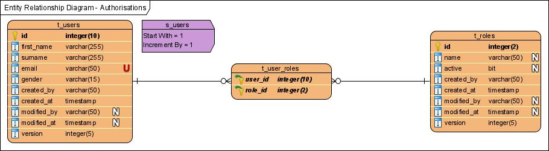

# spring-data-jpa-demo

Demo project using Spring Data JPA on Spring Boot. It shows a user management module storing users and roles in an SQL database.

Here it is the database model of this application:

This project uses:

- Spring Boot 3.0
- Spring Data JPA 3.0
- Spring Framework 6.0
- Spring Batch 5.0
- Liquibase 4.17
- Embedded H2 Database
- Built-on Maven

It requires Java 17+.

## Spring Data JPA and Spring Boot

This project contains some examples about:

- How to build entities and collections on JPA
- How to use a generic class shared between entities
- How to use the auditing feature from Spring Data
- How to use Spring Boot Test in order to test reading and writing interactions with the database

## Maven subprojects

This project is separated into subprojects in order to keep best practices on layers in Spring:

- *myproject-api*: Contains entities, enums and services declarations
- *myproject-db*: Contains the scripts and dependencies needed to build the database
- *myproject-core*: Contains the repositories and services implementations, it is, the business core of the application
- *myproject-web*: Contains the Web controllers and the DTO definitions for the HTTP layer.
- *myproject-batch*: Contains batch configuration and jobs

## Building and running this project

In order to build this project for the first time, use the following command:

    $ ./mvnw clean install
  
 After that, you can run the Spring Boot application using the following command:
 
    $ java -jar myproject-web/target/myproject-web.jar
